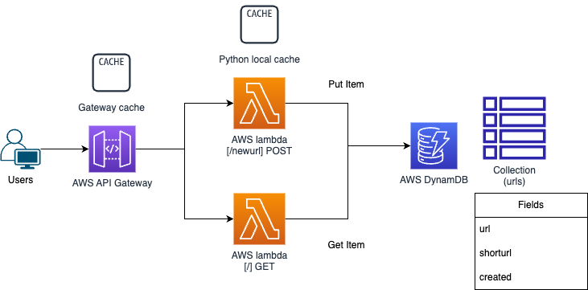
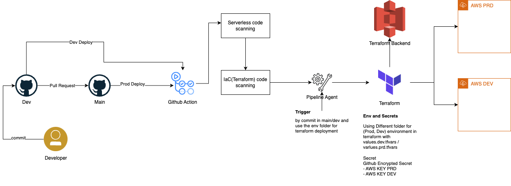

# URL Shortener

## Prerequisites

To use this project, you'll need to have the following tools installed:

- Terraform (version 0.14 or later)
- AWS CLI

You'll also need an AWS account and appropriate credentials configured on your machine.

## Configuration

### Variables

This project uses the following variables:

# Terraform Variables

This file defines the input variables for the Terraform module.

## Variables

| Name | Description | Type | Default       | Required |
|------|-------------|------|---------------|----------|
| `environment` | The environment of the application deployment | `string` | `"dev"`       | Yes      |
| `project` | The Application project name | `string` | `"shorturls"` | Yes       |
| `region` | The AWS reegion to use for the Short URL project | `string` | `"ap-east-1"` | Yes       |
| `apigateway_stage` | The API Gateway stage name for the release | `string` | `"prod"`      | No       |
| `apigateway_cachesize` | The cachesize for the release stage | `string` | `"0.5"`       | No       |
| `lambda_cachesize` | The cachesize for the lambda local cache | `string` | `"1024"`      | No       |
| `lambda_cachettl` | The cachesize for the lambda local cache ttl | `string` | `"10"`        | No       |
| `lambda_memory` | The cachesize for the lambda memory | `string` | `"128"`       | No       |
| `dynamodb_table` | The dynamo table to store the urls and shorturls | `string` | `"urls"`      | No       |
| `dynamodb_table_read_cap` | The dynamo table read capacity | `number` | `10`          | No       |
| `dynamodb_table_write_cap` | The dynamo table write capacity | `number` | `10`          | No       |

## Usage

To deploy the project `locally`, follow these steps:

1. Clone the project repository to your local machine.
2. Change directory to `cd terraform`
3. Make sure 
4. Run `terraform init` to initialize the project and download any required dependencies.
5. [optional] Create a `terraform.tfvars` file with your desired variable values.
6. Run `terraform plan` to preview the changes that Terraform will make.
7. Run `terraform apply` to apply the changes and deploy the infrastructure.

## Assumptions

- In this solution,we do not handle the custom dns for API service and can be implemented after
- This solution focusing on the requirements and security (VPC, encryption) can be handled after
- This solution designed for single region in the current phase

## Architecture

This project deploys the following resources:

- An AWS API Gateway with cache enabled
- Two lambda services in python with local cache enabled
- A DynamoDB for storing the urls

The architecture diagram is shown below:

## Requirement Discussions

- Tech Stack
  - API gateway designed for high performance API services
  - AWS Lambda low cost, autoscaling and easy to use for simple stateless API architecture
  - AWS DynamoDB , key value store, distributed database,  one of the best choice for the url/shorturl datastore without joins query
  
- High Availability
  - API Gateway is designed to be highly availability and  built around AWS Regions and Availability Zones
  - Lambda runs functions in multiple Availability Zones to ensure that it is available to process events in case of a service interruption in a single zone
  - DynamoDB also served with High Availability and can be extended the replicas to multiple region.
    - it also supports point in time recovery
  
- Scalable with ease
  - Most of the component take care of itself 
  - Others can be updated terraform for scalable

- Scaling up to 1000+ req/s
  - API gateway
    - Support up to 10000 req/s
  - Lambda
    - Concurrent executions is 1000 by default quota, since the request should be fast and under 1s
      - this quota can be increased by request
  - DynamoDB table are partitioned by partition key
    - Each partition serve up to 1000 write or 3000 read capacity unit
    - Partitioning is done behind the scene if the cap exceeds
    - shorturl should have high cardinality to evenly distribute records among different partition
  
- Caching
  - API Gateway caching (up to 200+GB) can served as the front door caching the result before flowing to AWS Lamda
  - ElasticCache can actually be the best choice of the Serverless layer, but due to it has to spawn in VPC. I use the python to replace as a local caching strategy. But in the extreme scenario 62^9 then ElasticCache should be used.
    - Besides, the url can not be update or modified, python local cache can be used and no data consistency too.
  - DAX cluster can later be served as the third layer cache for the DynamoDB
  
- Programming Language
  - Python is used as demo for easy to use and present the logic of the url shortener, a better choice will be Golang for high concurrent request and smaller footprint

- Expiring the legacy Data
  - Added created field in case of house keeping for obsoleted and data cleansing
  
- ShortURL generation
  - Current approach using a random generator with retry of 5 times(where the message "The short code has been taken" frequency is an indication of the collection should be filled up soon), a better approach would be using a global counter or MD5 hash 

## CICD Architecure and Dicussions

- Scanning IaC and Python lambda code
- Any deployment PR to main branch
- We can easily create env folder [dev, prd] for different environment deployment
- Actually any CICD tools will work (as long as the pipeline agent installed terraform). In the draft we use GitHub Action for  CICD tools
- A seperated S3 will served as Terraform Backend (Terraform Cloud can do too)
- Store the AWS KEY & Secret to Github Secrets
- Deploy on main branch merge trigger

